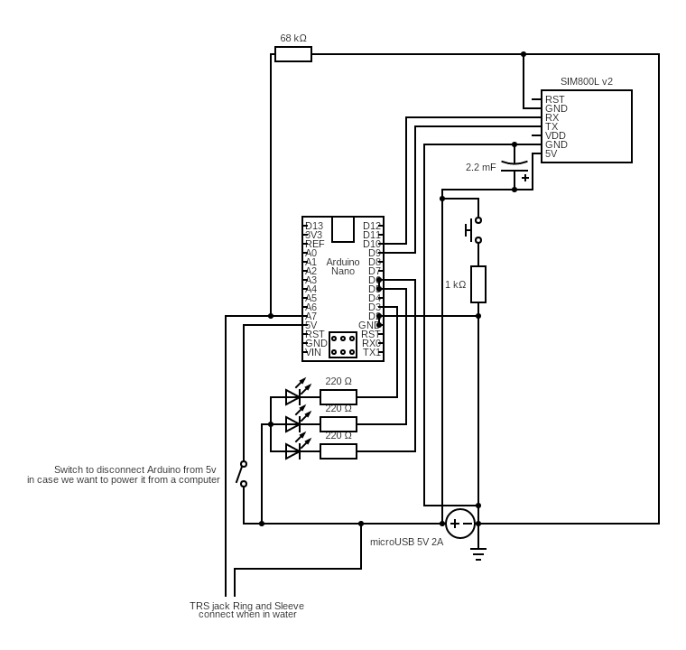

### Prototyping a device for automated SMS alarm in case of flood

#### What for?
Some friends have a large pinball collection in a flood prone location. They were flooded once and nobody noticed until there was already a lot (tens of cm) of water on the floor. The aim of this project was to build the simplest possible device that monitors the situation and if necessary sends alarm messages via SMS.

#### The logic flow:

#### The circuit:

**The current status** of this project is that I have not managed to get the SIM800L to work reliably. I read it can pull up to 2A of current when it is talking to the network, and I suspect this is the reason it sometimes fails to operate. Investigations will continue next fall when the rain season is approaching.

Otherwise it seemed to work as intended. The water detection "sensor" is actually a normal stereo audio cable. When the jack is submerged in conductive material a connection happens between the ring and sleeve and we get a reading.
